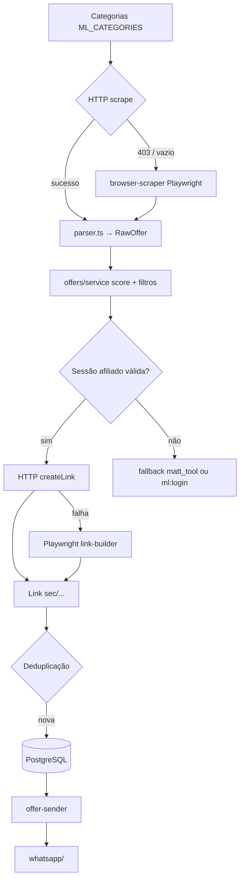

# Arquitetura

Sistema em processos separados, organizado por domínio. Integração com Mercado Livre via **scraping híbrido** (HTTP + Playwright) e **sessão de afiliado persistida**.

## Estrutura

```
src/
├── app.ts              → collector (coleta + enfileira)
├── worker.ts           → WhatsApp + envio
├── ml-login.ts         → login afiliado ML (setup manual)
├── config/             → ENV (Zod)
├── whatsapp/           → Baileys
├── mercado-livre/      → scraping + sessão afiliado
│   ├── http-scraper.ts
│   ├── browser-scraper.ts
│   ├── parser.ts
│   ├── session.ts
│   ├── affiliate-link.ts
│   └── auth.ts
├── offers/             → domínio de ofertas
├── jobs/               → workers BullMQ
├── queue/              → filas Redis
├── database/           → Prisma
└── utils/              → logger
```

## Decisões arquiteturais

### Scraping híbrido vs API Oficial

| Camada | Estratégia |
|--------|------------|
| Coleta de produtos | HTTP (`fetch` + Cheerio/parser) como caminho principal |
| Coleta (fallback) | Playwright quando HTTP retorna bloqueio ou HTML vazio |
| Links de afiliado | HTTP `createLink` com cookies da sessão salva |
| Auth afiliado | Playwright com login manual (`npm run ml:login`), persistência em `ML_AUTH_PATH` |
| Fallback de link | Playwright no link-builder → parâmetros `matt_tool`/`matt_word` |

**Motivos:** API oficial descartada; programa de afiliados não expõe API pública para links encurtados; sessão persistida espelha o padrão Baileys do WhatsApp.

### Processos separados

Collector (`app.ts`) e sender (`worker.ts`) rodam em processos distintos. Login de afiliado é comando separado (`ml-login.ts`), executado sob demanda.

## Fluxo completo



## Princípios

- HTTP primeiro, browser só quando necessário.
- Sessão de afiliado em disco (`./data/ml_auth/`), nunca hardcoded.
- Regras de negócio apenas em `offers/`.
- Playwright não roda em cada ciclo de coleta — apenas fallback.

## Documentação relacionada

- [Mercado Livre — Scraping](./mercado-livre.md)
- [Filas](./queues.md)
- [Database](./database.md)
- [WhatsApp](./whatsapp.md)
- [Deployment](./deployment.md)
- [Implementation Board](../IMPLEMENTATION_BOARD.md)
