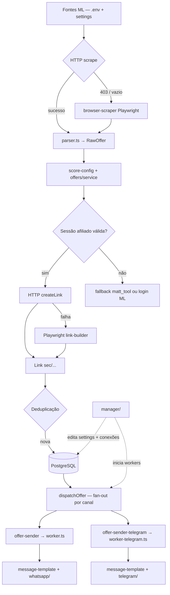

# Arquitetura

Sistema em processos separados, organizado por domínio. Integração com Mercado Livre via **scraping híbrido** (HTTP + Playwright) e **sessão de afiliado persistida**. Configuração runtime editável via painel **manager**.

## Estrutura

```
src/
├── app.ts              → collector (coleta + enfileira)
├── worker.ts           → envio WhatsApp
├── worker-telegram.ts  → envio Telegram
├── ml-login.ts         → login afiliado ML (setup manual / CLI)
├── wa-login.ts         → login WhatsApp (CLI)
├── config/             → ENV (Zod) + stores de runtime
│   ├── env.ts
│   ├── score-config.ts
│   ├── brand-config.ts
│   ├── ml-sources-config.ts
│   └── queue-config-store.ts
├── channels/           → contrato de canal + publishers + worker-runner
├── whatsapp/           → Baileys + channel-cache
├── telegram/           → Bot API (fetch)
├── mercado-livre/      → scraping + sessão afiliado
├── offers/             → domínio de ofertas + message-template
├── jobs/               → workers BullMQ (sender genérico por canal)
├── queue/              → filas Redis + sender-schedule
├── database/           → Prisma
├── scripts/            → preflight, up
└── utils/              → logger, datetime, log-store

manager/                → painel web (MVC)
├── server.ts
├── routes/
├── controllers/
├── models/
└── views/
```

## Decisões arquiteturais

### Scraping híbrido vs API Oficial

| Camada | Estratégia |
|--------|------------|
| Coleta de produtos | HTTP (`fetch` + Cheerio/parser) como caminho principal |
| Coleta (fallback) | Playwright quando HTTP retorna bloqueio ou HTML vazio |
| Links de afiliado | HTTP `createLink` com cookies da sessão salva |
| Auth afiliado | Playwright com login manual (painel ou `npm run ml:login`) |
| Fallback de link | Playwright no link-builder → parâmetros `matt_tool`/`matt_word` |

**Motivos:** API oficial descartada; programa de afiliados não expõe API pública para links encurtados; sessão persistida espelha o padrão Baileys do WhatsApp.

### Config runtime (settings DB)

Parâmetros operacionais (score, intervalos, horários, template, brand, fontes ML) persistidos na tabela `settings`. Editáveis pelo manager; lidos com cache em memória nos processos `app`, `worker` e `manager`. Fallback para `QUEUE_CONFIG` e defaults em ENV.

### Processos separados

| Processo | Entry | Função |
|----------|-------|--------|
| Collector | `app.ts` | Coleta periódica + enfileiramento |
| Sender WhatsApp | `worker.ts` | Envio WhatsApp com janela operacional |
| Sender Telegram | `worker-telegram.ts` | Envio Telegram com janela operacional |
| Manager | `manager/server.ts` | Painel admin + conexões + controle dos workers |
| ML Login | `ml-login.ts` | Setup manual de sessão afiliado (CLI) |

O `npm run up` sobe collector + manager. Os workers são iniciados pelo painel para evitar conflito de sessão WhatsApp.

### Um canal, um processo

Cada canal de envio roda no seu próprio processo, com fila própria, e implementa o contrato `ChannelPublisher`. Falha isolada: uma queda do WhatsApp não impede o Telegram de publicar. O estado de envio é por canal (`OfferDelivery`), não por oferta — ver [Canais](./channels.md).

## Fluxo completo



## Princípios

- HTTP primeiro, browser só quando necessário.
- Sessão de afiliado em disco (`./data/ml_auth/`), nunca hardcoded.
- Regras de negócio apenas em `offers/` e `config/score-config.ts`.
- Manager apenas orquestra UI — reutiliza `src/`.
- Um único processo mantém conexão WhatsApp ativa (worker).
- Um canal, um processo — o envio de um canal nunca derruba o outro.
- Playwright não roda em cada ciclo de coleta — apenas fallback.

## Documentação relacionada

- [Mercado Livre — Scraping](./mercado-livre.md)
- [Filas](./queues.md)
- [Database](./database.md)
- [Canais de envio](./channels.md)
- [WhatsApp](./whatsapp.md)
- [Telegram](./telegram.md)
- [Manager](./manager.md)
- [Deployment](./deployment.md)
- [Implementation Board](../IMPLEMENTATION_BOARD.md)
