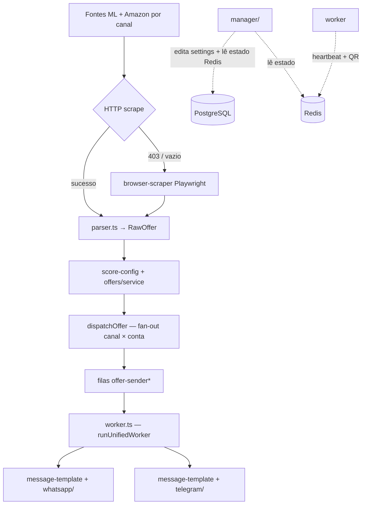

# Arquitetura

Sistema em processos separados, organizado por domínio. Integração com Mercado Livre via **scraping híbrido** (HTTP + Playwright) e **sessão de afiliado persistida**. Configuração runtime editável via painel **manager**.

## Estrutura

```
src/
├── app.ts              → collector (coleta + enfileira)
├── scheduler.ts        → agendador de mensagens automáticas
├── worker.ts           → envio unificado (WhatsApp + Telegram)
├── ml-login.ts         → login afiliado ML (setup manual / CLI)
├── wa-login.ts         → login WhatsApp (CLI)
├── config/             → ENV (Zod) + stores de runtime
│   ├── env.ts
│   ├── score-config.ts
│   ├── brand-config.ts
│   ├── ml-sources-config.ts
│   ├── amazon-sources-config.ts
│   ├── amazon-config-store.ts
│   ├── queue-config-store.ts
│   └── coupons-config-store.ts
├── accounts/           → multi-conta (tabela Prisma `accounts`)
├── affiliates/         → registro de plataformas de afiliado
├── sources/            → roteamento ML + Amazon no collector
├── channels/           → contrato de canal + publishers + worker-runner
├── whatsapp/           → Baileys + channel-cache
├── telegram/           → Bot API (fetch)
├── mercado-livre/      → scraping + sessão afiliado + cupons
├── amazon/             → scraping + links de afiliado (?tag=)
├── offers/             → domínio de ofertas + templates + cupons + roteamento afiliado
├── auto-messages/      → mensagens automáticas agendadas
├── jobs/               → workers BullMQ (collector, sender genérico)
├── queue/              → filas Redis + sender-schedule
├── database/           → Prisma
├── scripts/            → preflight, up
└── utils/              → logger, datetime, log-store, redis-state, metrics

manager/                → painel web (MVC)
├── server.ts
├── http/               → router declarativo + helpers HTTP
├── routes/             → exporta handleManagerRequest
├── controllers/
├── models/
├── views/
└── public/             → CSS/JS estáticos
```

## Decisões arquiteturais

### Scraping híbrido vs API Oficial

| Camada | Estratégia |
|--------|------------|
| Coleta de produtos | HTTP (`fetch` + Cheerio/parser) como caminho principal |
| Coleta (fallback) | Playwright quando HTTP retorna bloqueio ou HTML vazio |
| Proteção anti-falha | Circuit breaker (`circuit-breaker.ts`) |
| Links de afiliado | HTTP `createLink` com cookies da sessão salva |
| Auth afiliado | Playwright com login manual (painel ou `npm run ml:login`) |
| Fallback de link | Playwright no link-builder → parâmetros `matt_tool`/`matt_word` |
| Cupons | HTTP + parse (`coupons.ts` / `coupon-parser.ts`) |

**Motivos:** API oficial descartada; programa de afiliados não expõe API pública para links encurtados; sessão persistida espelha o padrão Baileys do WhatsApp.

### Config runtime (settings DB)

Parâmetros operacionais (score, intervalos, horários, templates, brand, fontes ML/Amazon, cupons, contas) persistidos na tabela `settings`. Editáveis pelo manager; lidos com cache em memória nos processos `app`, `worker` e `manager`. Fallback para `QUEUE_CONFIG` e defaults em ENV.

### Processos separados

| Processo | Entry | Função |
|----------|-------|--------|
| Collector | `app.ts` | Coleta periódica + enfileiramento (Playwright pooled) |
| Scheduler | `scheduler.ts` | Mensagens automáticas programadas (leve) |
| Sender (unificado) | `worker.ts` | Envio WhatsApp + Telegram — todas as contas habilitadas |
| Manager | `manager/server.ts` | Painel admin — leitor de estado em produção |
| ML Login | `ml-login.ts` | Setup manual de sessão afiliado (CLI) |

O `npm run up` sobe collector + scheduler + manager. Em **dev** (`MANAGER_CAN_SPAWN_WORKERS=true`), o painel pode spawnar o worker unificado. Em **produção/Docker**, o worker é um serviço separado (`worker`).

### Microsserviços de envio

Quatro processos independentes: **collector**, **scheduler**, **worker** (sender) e **manager**. O worker de envio é **único** — `runUnifiedWorker()` em `channels/worker-runner.ts` carrega todos os publishers habilitados (`loadAllWorkerPublishers`) e consome **todas** as filas BullMQ de sender (WhatsApp, Telegram e variantes por conta) no mesmo processo.

Filas permanecem **separadas por canal e conta** (isolamento de jobs e retry). Publishers implementam `ChannelPublisher`. O estado de envio é por `(canal, conta)` em `OfferDelivery` — ver [Canais](./channels.md).

> Não escale o serviço `worker` horizontalmente — uma sessão Baileys por auth path exige um único processo dono (`owner.lock`).

### Multi-conta

Domínio `accounts/` + tabela Prisma `accounts` + `account_id` em `offer_deliveries` + fan-out em `dispatchOffer`. Runtime: fila, sender e publishers por `accountId`; o worker unificado instancia um publisher (e um BullMQ Worker) por par `(canal, conta)` habilitado — ver [Contas](./accounts.md).

## Fluxo completo


```mermaid
flowchart TD
    A[Fontes ML + Amazon por canal] --> B{HTTP scrape}
    B -->|sucesso| C[parser.ts → RawOffer]
    B -->|403 / vazio| D[browser-scraper Playwright]
    D --> C
    C --> E[score-config + offers/service]
    E --> F[dispatchOffer — fan-out canal × conta]
    F --> G[filas offer-sender*]
    G --> H[worker.ts — runUnifiedWorker]
    H --> I[message-template + whatsapp/]
    H --> J[message-template + telegram/]
    K[manager/] -.->|edita settings + lê estado Redis| L[(PostgreSQL)]
    W[worker] -.->|heartbeat + QR| R[(Redis)]
    K -.->|lê estado| R
```

## Qualidade e CI

- TypeScript `strict: true`; `tsconfig.check.json` inclui `src/` e `manager/`.
- CI: `.github/workflows/ci.yml` — `npm ci` → `tsc` → `npm test`.
- ~28 testes unitários (`node:test`); cobertura em parser ML/Amazon, score, sampling, circuit-breaker, coupon-parser, account-config, redis-state, jobs.

## Princípios

- HTTP primeiro, browser só quando necessário.
- Sessão de afiliado em disco (`./data/ml_auth/`), nunca hardcoded.
- Regras de negócio apenas em `offers/`, `auto-messages/` e `config/score-config.ts`.
- Manager apenas orquestra UI — reutiliza `src/`.
- Um único processo mantém conexão WhatsApp ativa por sessão (worker + lock de dono + QR no Redis).
- Worker unificado — um processo consome todas as filas de envio; filas separadas por canal isolam retry e ritmo.
- Playwright não roda em cada ciclo de coleta — apenas fallback.

## Documentação relacionada

- [Mercado Livre — Scraping](./mercado-livre.md)
- [Amazon — Scraping](./amazon.md)
- [Filas](./queues.md)
- [Database](./database.md)
- [Canais de envio](./channels.md)
- [Contas](./accounts.md)
- [WhatsApp](./whatsapp.md)
- [Telegram](./telegram.md)
- [Manager](./manager.md)
- [Deployment](./deployment.md)
- [Implementation Board](../IMPLEMENTATION_BOARD.md)
