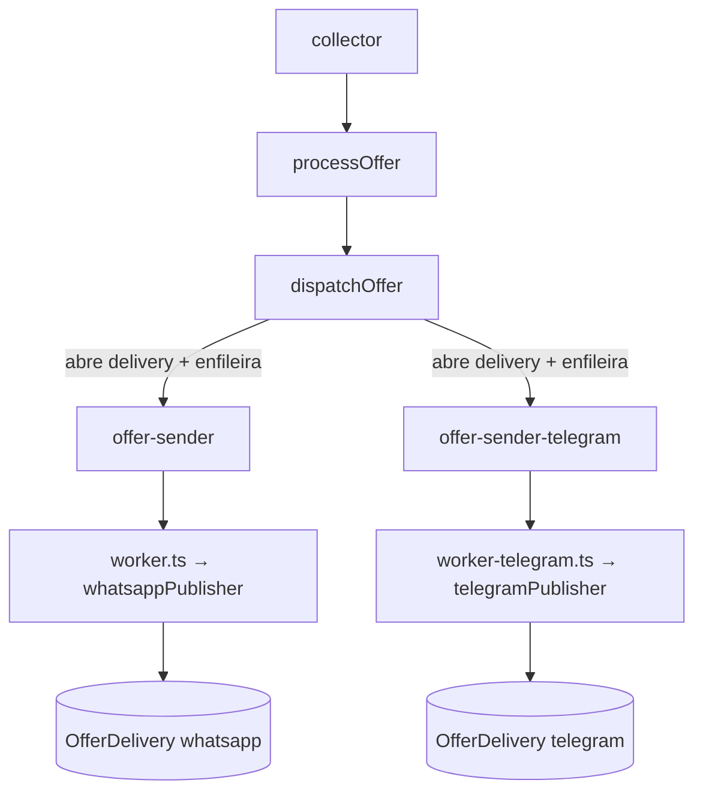

# Canais de envio

Uma oferta coletada é publicada em **um ou mais canais**, cada um com seu processo, sua fila e seu ritmo. WhatsApp e Telegram não se afetam: se um cai, o outro continua publicando.

## Peças

```
src/channels/
├── types.ts              → Channel, ChannelPublisher (o contrato)
├── index.ts              → registro dos publishers + canais ligados
├── whatsapp-publisher.ts → sessão Baileys, lock de dono
├── telegram-publisher.ts → Bot API stateless
├── publisher-factory.ts  → getPublisher(channel, accountId)
└── worker-runner.ts      → boot compartilhado + heartbeat Redis

src/accounts/
└── worker-publisher.ts   → loadWorkerPublisher(platform) — resolve conta via WORKER_ACCOUNT_ID

src/worker.ts           → processo do WhatsApp
src/worker-telegram.ts  → processo do Telegram
```

O `jobs/sender.ts` é **genérico**: recebe um `ChannelPublisher` e processa ofertas, auto-messages e texto livre. O que muda entre canais é o publisher.

## Fluxo



`dispatchOffer` itera canais ligados × contas habilitadas por plataforma. Cada par `(canal, accountId)` gera uma `OfferDelivery` e um job na fila.

## Estado por canal — `OfferDelivery`

Uma linha por `(oferta, canal, conta)` — é a **fonte da verdade** de quem recebeu o quê.

| Estado | Significado |
|--------|-------------|
| linha ausente | O canal/conta não estava ligado quando a oferta foi coletada |
| `sentAt` nulo | Enfileirada, ainda não publicada |
| `sentAt` nulo + `error` | Última tentativa falhou (o BullMQ ainda retenta) |
| `sentAt` preenchido | Publicada, com `messageId` do canal |

`Offer.sentAt` continua existindo, mas é **denormalizado**: marca o primeiro envio em qualquer canal. Serve ao dedup por título+preço e às visões globais do painel. Lógica por canal lê `OfferDelivery`, nunca `Offer.sentAt`.

## Filas

| Canal | Fila (default) | Fila (conta) | Worker |
|-------|----------------|--------------|--------|
| WhatsApp | `offer-sender` | `offer-sender-{accountId}` | `src/worker.ts` |
| Telegram | `offer-sender-telegram` | `offer-sender-telegram-{accountId}` | `src/worker-telegram.ts` |

Job id: `send-offer-{canal}-{offerId}` (default) ou `send-offer-{canal}-{accountId}-{offerId}`.

## Tipos de publicação

| Tipo | Origem | Payload do job |
|------|--------|----------------|
| Oferta | `dispatchOffer` | `{ offerId }` |
| Auto-message | `auto-messages/service` | `{ autoMessageId }` |
| Texto livre | `coupon-service`, envio manual | `{ text }` |

Todos passam pelo mesmo `jobs/sender.ts` e pelo `ChannelPublisher.publish()` ou `publishText()`.

## Adicionar um canal novo

1. Implemente `ChannelPublisher` em `src/channels/<canal>-publisher.ts`
2. Registre em `CHANNELS` (`types.ts`) e em `PUBLISHERS` (`index.ts`)
3. Adicione a fila em `SENDER_QUEUE_NAMES` (`queue/index.ts`)
4. Crie o entry `src/worker-<canal>.ts` com `runChannelWorker(publisher)`
5. Adicione o serviço no `docker-compose.yml` e o script no `package.json`

O fan-out (`dispatchOffer`), o painel e as stats passam a incluir o canal sozinhos — todos derivam de `getEnabledChannels()`.

## Multi-conta

Runtime completo: `dispatchOffer` enfileira por `accountId`, sender lê `accountId` do job, publishers resolvem auth path por conta. Worker consome conta via `WORKER_ACCOUNT_ID`. Pendente: spawn de workers por conta no painel. Ver [Contas](./accounts.md).

## Princípios

- Um processo por canal — falha isolada.
- O publisher é a única parte que conhece o protocolo do canal.
- `isEnabled()` decide tudo: canal desligado não enfileira e o worker encerra no boot.
- Entrega aberta **antes** de enfileirar: nada some sem rastro.
- O template da mensagem é compartilhado entre os canais (ofertas e cupons têm templates próprios).

## Documentação relacionada

- [WhatsApp](./whatsapp.md)
- [Telegram](./telegram.md)
- [Filas](./queues.md)
- [Database](./database.md)
- [Contas](./accounts.md)
