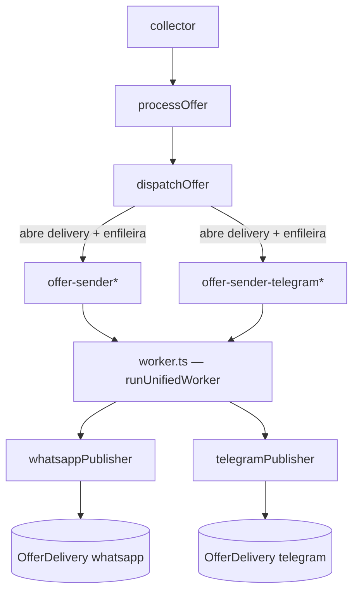

# Canais de envio

Uma oferta coletada é publicada em **um ou mais canais**, cada um com sua fila BullMQ e seu publisher. WhatsApp e Telegram compartilham o **mesmo processo worker** — filas separadas isolam retry e ritmo; falha de verificação de um canal não impede os demais de subir no boot.

## Peças

```
src/channels/
├── types.ts              → Channel, ChannelPublisher (o contrato)
├── index.ts              → registro dos publishers + canais ligados
├── whatsapp-publisher.ts → sessão Baileys, lock de dono
├── telegram-publisher.ts → Bot API stateless
├── publisher-factory.ts  → createPublisher(account)
└── worker-runner.ts      → runUnifiedWorker() — boot + heartbeat Redis

src/accounts/
└── worker-publisher.ts   → loadAllWorkerPublishers() — todas as contas habilitadas

src/worker.ts             → entry do worker unificado (WhatsApp + Telegram)
```

O `jobs/sender.ts` é **genérico**: recebe um `ChannelPublisher` e processa ofertas, auto-messages e texto livre. O worker unificado instancia **um** BullMQ Worker por publisher ativo.

## Fluxo


```mermaid
flowchart TD
    A[collector] --> B[processOffer]
    B --> C[dispatchOffer]
    C -->|abre delivery + enfileira| D[offer-sender*]
    C -->|abre delivery + enfileira| E[offer-sender-telegram*]
    D --> F[worker.ts — runUnifiedWorker]
    E --> F
    F --> G[whatsappPublisher]
    F --> H[telegramPublisher]
    G --> I[(OfferDelivery whatsapp)]
    H --> J[(OfferDelivery telegram)]
```

`dispatchOffer` itera canais ligados × contas habilitadas por plataforma. Cada par `(canal, accountId)` gera uma `OfferDelivery` e um job na fila correspondente.

## Estado por canal — `OfferDelivery`

Uma linha por `(oferta, canal, conta)` — é a **fonte da verdade** de quem recebeu o quê.

| Estado | Significado |
|--------|-------------|
| linha ausente | O canal/conta não estava ligado quando a oferta foi coletada |
| `sentAt` nulo | Enfileirada, ainda não publicada |
| `sentAt` nulo + `error` | Última tentativa falhou (o BullMQ ainda retenta) |
| `sentAt` preenchido | Publicada, com `messageId` do canal |

`Offer.sentAt` continua existindo, mas é **denormalizado**: marca o primeiro envio em qualquer canal. Serve ao dedup por título+preço e às visões globais do painel. Lógica por canal lê `OfferDelivery`, nunca `Offer.sentAt`.

## Filas

| Canal | Fila (default) | Fila (conta) | Consumidor |
|-------|----------------|--------------|------------|
| WhatsApp | `offer-sender` | `offer-sender-{accountId}` | `worker.ts` (unificado) |
| Telegram | `offer-sender-telegram` | `offer-sender-telegram-{accountId}` | `worker.ts` (unificado) |

Job id: `send-offer-{canal}-{offerId}` (default) ou `send-offer-{canal}-{accountId}-{offerId}`.

## Tipos de publicação

| Tipo | Origem | Payload do job |
|------|--------|----------------|
| Oferta | `dispatchOffer` | `{ offerId }` |
| Auto-message | `auto-messages/service` | `{ autoMessageId }` |
| Texto livre | `coupon-service`, envio manual | `{ text }` |

Todos passam pelo mesmo `jobs/sender.ts` e pelo `ChannelPublisher.publish()` ou `publishText()`.

## Adicionar um canal novo

1. Implemente `ChannelPublisher` em `src/channels/<canal>-publisher.ts`
2. Registre em `CHANNELS` (`types.ts`) e em `PUBLISHERS` (`index.ts`)
3. Adicione a fila em `SENDER_QUEUE_NAMES` (`queue/index.ts`)
4. Estenda `createPublisher()` em `publisher-factory.ts` se necessário

O worker unificado passa a consumir a nova fila automaticamente via `loadAllWorkerPublishers()` — **não** crie entry `worker-<canal>.ts` separado. O fan-out (`dispatchOffer`), o painel e as stats passam a incluir o canal sozinhos — todos derivam de `getEnabledChannels()`.

## Multi-conta

Runtime completo: `dispatchOffer` enfileira por `accountId`, sender lê `accountId` do job, publishers resolvem auth path por conta. O worker unificado carrega um publisher por `(canal, accountId)` habilitado. Spawn único pelo painel em dev (`MANAGER_CAN_SPAWN_WORKERS=true`). Ver [Contas](./accounts.md).

## Princípios

- **Um worker, múltiplas filas** — microsserviço de envio único; filas BullMQ separadas por canal/conta.
- O publisher é a única parte que conhece o protocolo do canal.
- `isEnabled()` decide tudo: canal desligado não enfileira e o publisher é ignorado no boot.
- Entrega aberta **antes** de enfileirar: nada some sem rastro.
- O template da mensagem é compartilhado entre os canais (ofertas e cupons têm templates próprios).
- Não escale o worker horizontalmente — sessão WhatsApp exige processo único (`owner.lock`).

## Documentação relacionada

- [WhatsApp](./whatsapp.md)
- [Telegram](./telegram.md)
- [Filas](./queues.md)
- [Database](./database.md)
- [Contas](./accounts.md)
